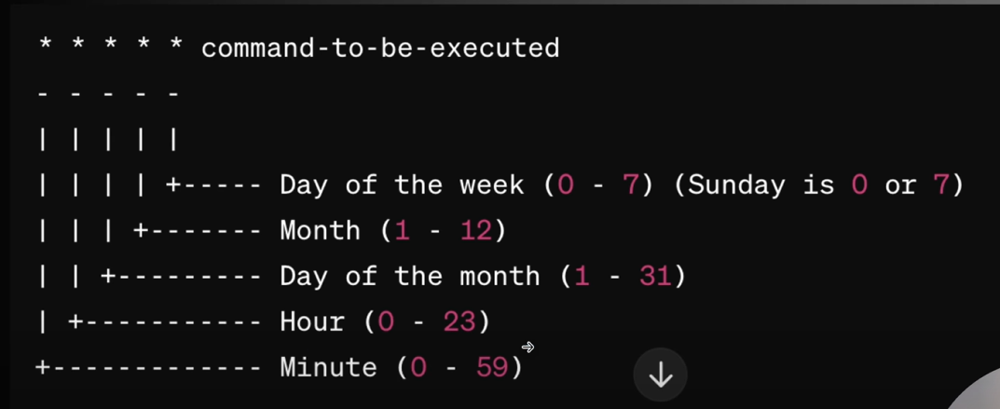

## 1) why /etc/passwd and /etc/shadow can't be merged into one file ?

A) /etc/passwd file consists of users details and it may be used by other applications. And /etc/shadow consists of passwords of the users which are stored in hash format.

- If we merge the both in one file, the applications that are using etc/passwd file can have access to password which are stored in hased format and can lead to some security breach.

## 2) Command to list all the processes ?

A) `ps -e`

## 3) To list all the files opened by particular PID

A) `lsof -p PID`

## 4) What is linux and what are it's main features ?

A) Linux is free and open source operating system based on unix. It main features include security, stability, support for hardware features, flexibility.

## 5) What is the difference between linux and Unix ?

A) The primary difference between linux and unix is linux is open source and free whereas unix is proprietary. Additionally linux is used for wide variety of applications, whereas unix is used only at enterprise level.

## 6) What is the linux kernel ?

A) Kernel is the core part of the operating system. It acts as a interface b/w computer's hardware and the software applications that are running on it. It manages hardware resources, enables process control, file mgmt and system secuirty.

## 7) What are the different types of shell you've seen ?

A) BASH, KSH (Korn shell)

## 8) How do you change file permissions in linux ?

A) `chmod u=rwx,g=rw,o= <filename>`

## 9) What is a daemon in linux ?

A) A daemon is a background process that runs continuously and typically starts at boot of system.

## 10) What is the difference between soft link and hard link in linux ?

A) A soft link is a pointer to the file whereas hard link is just the replica of file, if you update the file in which had hard link the another file will be getting update automatically.

- Deleting the original file affects a soft link but not hard link.
- Types of Symbolic link are soft link and hardlink.

## 11) What is the use of df command in linux ?

A) The df command is used to display disk space uasge of file systems.

## 12) What does the free command do in linux ?

A) The free command will display the total memory used and how much memory is left over for physical RAM and Swap memory in system.

## 13) what are inodes in Linux ?

A) An inode is a data structure that stores information about the file except it's name and actual data. Every file/folder in linux will have an inode and it's identified by uniquer identifier called inode.

## 14) What is the purpose of crontab in linux ?

A) crontab is used to schedule command which need to be executed periodically. It holds the list of scheduled tasks.

- by using crontab -l command you can see the list of scheduled tasks.

## 15) How can you find the ip address of linux server ?

A) `ifconfig`

## 16) Explain the purpose of the sshd service.

A) sshd is the SSH daemon that allows secure remote connections to the server.

## 17) How do you check the status of a system in linux ?

A) by using `systemctl status <servicename>`

## 18) 'Find' command in linux ?

A) `find [path-to-file] -name <filename>`

## 19) How can you how much size a file is occupying //

A) `du -h <filename>` it'll give you the size of the file

## 20) What is package manager in linux ?

A) A package manager is a collection of tools that automates the process of installing, upgrading, configuring, removing software packages in consistent manner.

## 21) How shell script starting line looks like ?

A) `#1/bin/bash`

## 22) What is the use of nohup command ?

A) nohup command is used to run a command/script in the background even after logging out from the shell.

## 23) What is the purpose of /var directory ?

A) The /var directory contains variable data like system logs, temporary files required for running applications.

## 24) What is the purpose of /etc/hosts ?

A) It us used to map hostnames to IP addresses.

## 25) How do you change the hostname of linux system ?

A) You can use `hostnamectl` command or by editing `/etc/hostname` file.

## 26) Explain the purpose of netstat command ?

A) netstat is used to display the network connections of the linux system.

## 27) What are Cron jobs ?

A) Cron jobs automate repetitve tasks, ensuring they run at scheduled times without manual intervention.

## 28) How does cron work ?

A) Cron uses a daemon(a background process) called cron to execute the scheduled tasks. The configuration for these tasks is stored in a file called crontab.

## 29) Basic Cron Job fromat

A)


## 30) How to list all crontab jobs ?

A) crontab -l

## 31) How to create crontab ?

A) crontab -e

- a editor will open.
- `<cronjob format> <path of the script>`
- see file `cronpoc.sh`

## 32) How to print all the environment variables ?

A) just type `env` on terminal.

## 33) How to print a specific env variable ?

A) `printenv <variablename>`

## 34) What is environment variable ?

A) The environment variables are dynamic values that are stored within a system and used by applications launched in shells or sub-shells.

## 35) How to set and access environment variables ?

A)

- To set env variable `export NAME=VALUE`
- To access env variable in other commands eg: `echo $NAME`
- These values will be avaiable only when your terminal is up and running, when close and open the terminal or shutdown you laptop and re-open it these variables will be disappeared.

## 36) How to delete env variables ?

A) Use `unset <variablename>`

## 37) How to set User persistent variables ?

A)

- Open the terminal.
- Edit the user-specific file (e.g., ~/.bashrc) using a text editor. type cmd `nano .bashrc`
- Insert the variable in the file with the export statement:

```
export NAME=Value
```

- Save and close the file.
- Activate the changes using:

```
$ source .bashrc
```

## 38) How to set Global Persistent Variables ?

A) For this u need to have access to /etc folder

```
nano environment
```

A file will open and set you env variable as `export Name=Value` save and exit now.

do `source environment` now

### 39) what happens when a linux system boots and till your login attempt ?

There are two sequences that are required to boot a linux system, they're boot and startup. Boot is the first step when the computer turned on and is completed when the kernel is intialized and get the systemd launched.
The startup process then takes over and finishes the task of getting the Linux computer into an operational state.

## 40) Explain about Inodes.

- When a file is created inside a direcotry then file name and Inode number are assigned to a file.
- When a user tries to access the file or any information related to the file then he/she uses the file name to do so but internally the file-name is first mapped with its Inode number stored in a table.

ls -i can be used to check the inode number of files.
df -i can be used to check the inode information of file system.

### Usage Scenario of an Inode number

Suppose there exist a file name with some special character in it. For example: “ab\*
Try to remove it normally using rm command, you will not be able to remove it.
However using the inode number of this file you can remove it.
`$ find . -inum 1448239 -exec rm -i {} \;`

## Find command

- **Find Files Using Name:** This example finds all files with name — MyCProgram.c in the current directory and all its sub-directories.

```
find -name "MyCProgram.c"
./backup/MyCProgram.c
./MyCProgram.c
```

- **Find Files Using Name and Ignoring Case:** This example finds all files with name — MyCProgram.c (ignoring the case) in the current directory and all its sub-directories.

````
find -iname "MyCProgram.c"
./mycprogram.c
./backup/mycprogram.c
./backup/MyCProgram.c
./MyCProgram.c```
````

- **Limit Search To Specific Directory Level Using mindepth and maxdepth:** Find the passwd file under all sub-directories starting from root directory

```
find / -name passwd
./usr/share/doc/nss_ldap-253/pam.d/passwd
./usr/bin/passwd
./etc/pam.d/passwd
./etc/passwd
```

Find the passwd file under root and one level down. (i.e root — level 1, and one sub-directory — level 2)

````
find -maxdepth 2 -name passwd
./etc/passwd```
````

Find the passwd file under root and two levels down. (i.e root — level 1, and two sub-directories — level 2 and 3 )

```
find / -maxdepth 3 -name passwd
./usr/bin/passwd
./etc/pam.d/passwd
./etc/passwd
```

Find the password file between sub-directory level 2 and 4.

```
find -mindepth 3 -maxdepth 5 -name passwd
./usr/bin/passwd
./etc/pam.d/passwd
```

- **Inverting the match:** Shows the files or directories whose name are not MyCProgram.c .Since the maxdepth is 1, this will look only under current directory.

```
find -maxdepth 1 -not -iname "MyCProgram.c"
.
./MybashProgram.sh
./create_sample_files.sh
./backup
./Program.c
```
