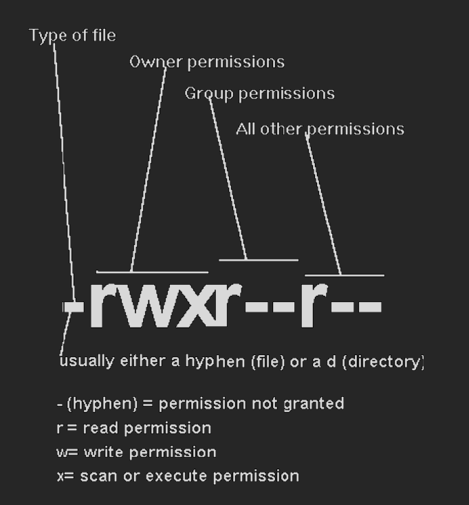

## Commands

### whoami:

If you are logged in with a username of “mahesh”, the whoami command will print mahesh
on the terminal. In another words, it prints the effective userID.

### who:

The who command displays a list of users currently logged in to the local system in detailed
format.
It displays each users
• login name,
• the login device (TTY port),
• the login date and time
**Output:**

```
ntisadmin pts/0 2024-10-01 01:26 (172.20.4.6)
```

Here
• 1st column shows the username of users who are logged on server.
• 2nd column shows device names of their respective terminal.These arethe filenames
associated with the terminals.(mahesh's terminal is pts/1).
• 3rd,4th,5th column shows date and time of logging in.
Last column shows machine name/ip from where the user has logged in.
It has more options which can be used.

### w:

Show who is logged and what they are doing.
UNIX maintains an account of all users who are logged on to system but along with that,,it also
shows what that particular user doing on his machine.
It also displays information about the users currently on the machine, and their processes.
The header shows, in this order, the current time, how long the system has been running, how
many users are currently logged on, and the system load averages for the past 1, 5, and 15
minutes.

**Output:**

```
 07:24:27 up 39 min,  0 users,  load average: 0.00, 0.00, 0.00
USER     TTY      FROM             LOGIN@   IDLE   JCPU   PCPU WHAT
```

The following entries are displayed for each user: login name,the tty name, the remote host,
login time, idle time, JCPU, PCPU, and the command line of their current process.
The JCPU time is the time used by all processes attached to the tty.
The PCPU time is the time used by the current process,named in the " what"field.

### uname:

knowing your machine charecteristic.
uname command displays certain features of the operating system running on your machine.
By default it simply displays the name of operating system.
**Syntax**
`uname [-a] [-i] [-n] [-p] [-r] [-v]`

### uptime:

Tell how long the system has been running.
Uptime gives a one line display of the following information.
The current time, how long the system has been running, how many users are currently logged
on, and the system load averages for the past 1, 5, and 15 minutes.

### date

The date command can be used to display or set the date. If a user has superuser privileges, he
or she can set the date by supplying a numeric string with the following command:
Fortunately there are options to manipulate the format. The format option is preceded by `+`
followed by any number of field descriptors indicated by % followed by a character to indicate
which field is desired. The allowed field

%m - month of year (01-12)
%n - prints output to new line
%d - day of month (01-31)
%y - last two digits of year (00-99)
%D - date as mm/dd/yy
%H - hour (00-23)
%M - minute (00-59)
%S - second (00-59)
%T - time as HH:MM:SS
%j - day of year (001-366)
%w - day of week (0-6) Sunday is 0
%a - abbreviated weekday (Sun-Sat)
%h - abbreviated month (Jan-Dec)
%r - 12-hour time w/ AM/PM (e.g., "03:59:42 PM")

**Set Date and Time**

**-s datestr** Sets the time and date to the value specified in the datestr. The datestr may
contain the month names, timezones, 'am', 'pm', etc. See examples for an example of how the
date and time can be set.

### free

Display amount of free and used memory in the system.
It displays the total amount of free and used physical and swap memory in the system, as well
as the buffers used by the kernel.The shared memory column should be ignored; it is obsolete.
In above output the memory description which is displayed it is in bytes.If user wants to display
it in required format that is in GB,MB or KB.
Command Options.
**free -k**
It will show the output in Kilobytes.
**free -g**
It will show the ouput in Gegabytes.
**free -m**
It will show the output in Megabytes.

### df -h

`df -h`
The df command displays information about total space and available space on a file system.

### ls -l

displays the long listing of files

**Column 1-** tells us the type of file, what privileges it has and to whom these privileges are
granted. There are three types of privileges. Read and write privileges are easy to understand.
The exec privilege is a little more difficult. We can make a file "executable" by giving it exec
privileges. This means that commands in the file will be executed when we type the file name in
at the UNIX prompt. It also means that when a directory which, to UNIX is a file like any other
file, can be "scanned" to see what files and sub-directories are in it.



1. The owner of the file. The owner is usually, but not always, the userid that created the file.
2. The group to which the owner belongs. At GSU, the group is usually, but not always
   designated as the first three letters of the userid of the owner.
3. Everybody else who has an account on the UNIX machine where the file resides.

**Column 2 -** Number of links
**Column 3 -** Owner of the file. Normally the owner of the file is the user account that originally
created it.
**Column 4 -** Group under which the file belongs. This is by default the group to which the
account belongs or first three letters of the userid. The group can be changed by the chgrp
command.
**Column 5 -** Size of file (bytes).
**Column 6 -** Date of last update
**Column 7 -** Name of file
