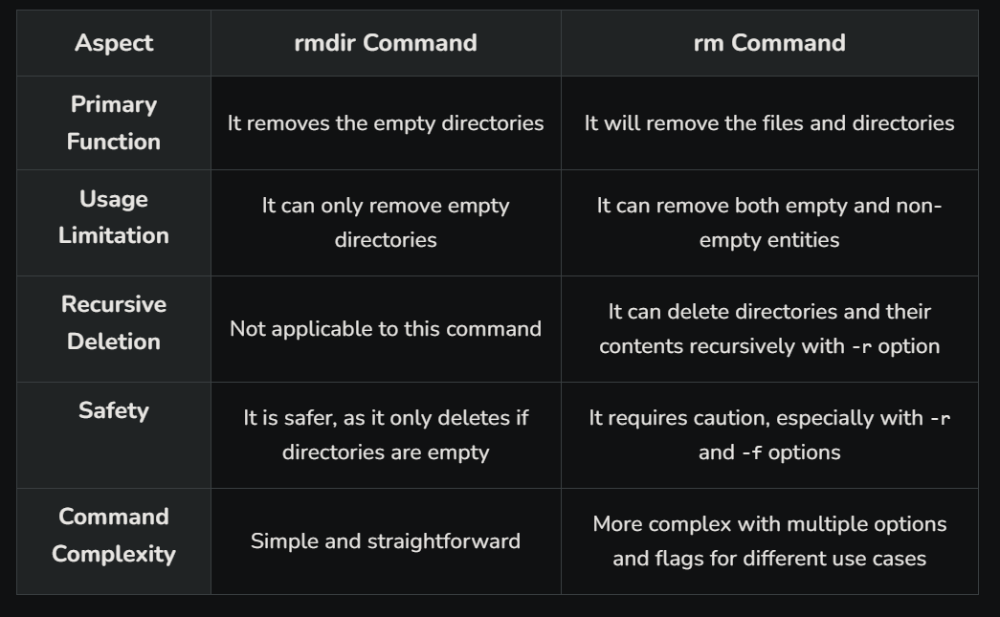

## Commands

### whoami:

If you are logged in with a username of “mahesh”, the whoami command will print mahesh
on the terminal. In another words, it prints the effective userID.

### who:

The who command displays a list of users currently logged in to the local system in detailed
format.
It displays each users
• login name,<br>
• the login device (TTY port),<br>
• the login date and time<br>
**Output:**

```
ntisadmin pts/0 2024-10-01 01:26 (172.20.4.6)
```

Here
• 1st column shows the username of users who are logged on server.<br>
• 2nd column shows device names of their respective terminal.These arethe filenames<br>
associated with the terminals.(mahesh's terminal is pts/1).<br>
• 3rd,4th,5th column shows date and time of logging in.<br>
Last column shows machine name/ip from where the user has logged in.<br>
It has more options which can be used.<br>

### w:

Show who is logged and what they are doing.<br>
UNIX maintains an account of all users who are logged on to system but along with that,,it also
shows what that particular user doing on his machine.<br>
It also displays information about the users currently on the machine, and their processes.<br>
The header shows, in this order, the current time, how long the system has been running, how
many users are currently logged on, and the system load averages for the past 1, 5, and 15
minutes.

**Output:**

```
 07:24:27 up 39 min,  0 users,  load average: 0.00, 0.00, 0.00
USER     TTY      FROM             LOGIN@   IDLE   JCPU   PCPU WHAT
```

The following entries are displayed for each user: login name,the tty name, the remote host,
login time, idle time, JCPU, PCPU, and the command line of their current process.<br>
The JCPU time is the time used by all processes attached to the tty.<br>
The PCPU time is the time used by the current process,named in the " what"field.<br>

### uname:

knowing your machine charecteristic.<br>
uname command displays certain features of the operating system running on your machine.<br>
By default it simply displays the name of operating system.<br>
**Syntax**
`uname [-a] [-i] [-n] [-p] [-r] [-v]`

### uptime:

Tell how long the system has been running.<br>
Uptime gives a one line display of the following information.<br>
The current time, how long the system has been running, how many users are currently logged
on, and the system load averages for the past 1, 5, and 15 minutes.<br>

### date

The date command can be used to display or set the date. If a user has superuser privileges, he
or she can set the date by supplying a numeric string with the following command:
Fortunately there are options to manipulate the format. The format option is preceded by `+`
followed by any number of field descriptors indicated by % followed by a character to indicate
which field is desired. The allowed field

%m - month of year (01-12)<br>
%n - prints output to new line<br>
%d - day of month (01-31)<br>
%y - last two digits of year (00-99)<br>
%D - date as mm/dd/yy<br>
%H - hour (00-23)<br>
%M - minute (00-59)<br>
%S - second (00-59)<br>
%T - time as HH:MM:SS<br>
%j - day of year (001-366)<br>
%w - day of week (0-6) Sunday is 0<br>
%a - abbreviated weekday (Sun-Sat)<br>
%h - abbreviated month (Jan-Dec)<br>
%r - 12-hour time w/ AM/PM (e.g., "03:59:42 PM")<br>

**Set Date and Time**

**-s datestr** Sets the time and date to the value specified in the datestr. The datestr may
contain the month names, timezones, 'am', 'pm', etc. See examples for an example of how the
date and time can be set.

### free

Display amount of free and used memory in the system.<br>
It displays the total amount of free and used physical and swap memory in the system, as well
as the buffers used by the kernel.The shared memory column should be ignored; it is obsolete.<br>
In above output the memory description which is displayed it is in bytes.If user wants to display
it in required format that is in GB,MB or KB.
Command Options.
**free -k**
It will show the output in Kilobytes.
**free -g**
It will show the ouput in Gegabytes.
**free -m**
It will show the output in Megabytes.

### df -h

`df -h`
The df command displays information about total space and available space on a file system.

### ls -l

displays the long listing of files

**Column 1-** tells us the type of file, what privileges it has and to whom these privileges are
granted. There are three types of privileges. Read and write privileges are easy to understand.<br>
The exec privilege is a little more difficult. We can make a file "executable" by giving it exec
privileges. This means that commands in the file will be executed when we type the file name in
at the UNIX prompt. It also means that when a directory which, to UNIX is a file like any other
file, can be "scanned" to see what files and sub-directories are in it.


1. The owner of the file. The owner is usually, but not always, the userid that created the file.<br>
2. The group to which the owner belongs. At GSU, the group is usually, but not always
   designated as the first three letters of the userid of the owner.<br>
3. Everybody else who has an account on the UNIX machine where the file resides.<br>

**Column 2 -** Number of links. <br>
**Column 3 -** Owner of the file. Normally the owner of the file is the user account that originally
created it.<br>
**Column 4 -** Group under which the file belongs. This is by default the group to which the
account belongs or first three letters of the userid. The group can be changed by the chgrp
command.<br>
**Column 5 -** Size of file (bytes)<br>
**Column 6 -** Date of last update<br>
**Column 7 -** Name of file.

### ls -a:

Shows us all files, even files that are hidden (these files begin with a dot.)

### more

It's used to view the contents of a file.

### cp

cp command copies file or group of files.It creates exact image of the file on disk with
dirrraent name. The syntax requires at leasr two filenames to be specified in the command
line.When both are ordinary files,the first is copied to second:

`cp file1 file2`

cp can also be used to copy more than one file with a single invocation of the command.In
that case the last filename must be a directory.you can use the cp command as follows.

`cp file1 file2 file3 backup`
Where the backup is a directory.

### mv

mv command has two distincts functions.
• It renames file(or directory)<br>
• It moves a group of files to diffrant directory<br>
mv doesn't create a copy of the file but it renames the file.No additional space is consumed on
disk during renaming.To rename the file hello.sh to welcome.sh use the following command.
`mv hello.sh welcome.sh`

### rm

The rm command deletes one or more files.It normally operates silently and should be used
with caution.
`rm file1 file2`

### Difference between ‘rmdir’ and ‘rm’ Command



### Backslash

The backslash character (\) has two uses (note this differs from the frontslash (/) character).<br>
The first use is for line continuation. If a line of shell commands becomes exceedingly long, it
may be useful to continue it across more than one line. Note that if you choose to do this, the
split cannot be in the middle of a word, it must be done in appropriate whitespace.<br>
The second (and perhaps more useful) use of the backslash character is to remove the special
meaning of the following single character. This is sometimes referred to as escaping the special
meaning of the following character. Characters that have special meaning are referred to as
metacharacters (there are many of these in Unix).

**Example:**
For example, if we wanted to output a statement to describe
the use of the $? variable, we could try and observe:
`echo The $? variable returns the child exit status` [Enter]
The 0 variable returns the child exit status
where what we really want is:
`echo The \$? variable returns the child exit status` [Enter]
The $? variable returns the child exit status

### Back Quotes

The back quotation mark character (i.e. `) when used in pairs enclosing a command serve to
perform command substitution. That is, when used as follows:
 `command`
the output of command is substituted at the location of the leftmost backquote. Note that
these are not the same character as the single quote mark. For example, if we wanted to
output:
My current directory is: current directory location
we could try the following:

```
echo My current directory is: pwd [Enter]
But this would result in:
 My current directory is: pwd
```

```
 echo My current directory is: `pwd` [Enter]
 My current directory is: /home/mthomas
```

### Single Quotes

Single quotes (not to be confused with the back quotes) serve to remove (escape) the special
meaning of all characters enclosed by them. Thus, the following statement would work as
follows:

```
 echo 'My current directory is: `pwd`' [Enter]
 My current directory is: `p
```

### Head Command:

The head command in Linux is used to display the first few lines of a file or the output of a command. By default, it prints the first 10 lines, but you can customize the number of lines using options.
**Syntax:**
`head [OPTION]... [FILE]...`

Common Options:

```
-n <number>: Specifies the number of lines to display.
head -n 5 filename.txt  # Display the first 5 lines
```

```
-c <number>: Specifies the number of bytes to display.
head -c 20 filename.txt  # Display the first 20 bytes
```

### Tail Command

The tail command in Linux is used to display the last part (usually the last 10 lines) of a file or the output of a command. It's commonly used to monitor log files in real-time or check the last few lines of a file.

**Syntax:**

```
tail [OPTION]... [FILE]...
```

Common Options:

```
-n <number>: Displays the last <number> of lines.
tail -n 20 filename.txt  # Display the last 20 lines
```

```
-c <number>: Displays the last <number> of bytes.
tail -c 50 filename.txt  # Display the last 50 bytes
```

```
-f: Follows the file as it grows, useful for real-time log monitoring.
tail -f logfile.txt  # Continuously display new lines added to the file
```

```
--pid=<PID>: Allows the -f option to terminate when the process with the specified PID ends.
tail -f --pid=1234 logfile.txt  # Follow logfile.txt until process 1234 terminates
```

### tr command:

The tr command in Linux is used for translating, replacing, or deleting characters from standard input and writing the result to standard output. It operates on single characters and can be used for simple transformations or deletions of characters.

**Syntax:**
`tr [OPTION] SET1 [SET2]`<br>
SET1: A set of characters to replace or delete.<br>
SET2: A set of characters that will replace corresponding characters from SET1. If SET2 is omitted, characters from SET1 are deleted.<br>

Direct file modification: tr doesn't modify files directly (like sed -i does). You either pipe the file's content or redirect it to tr.<br>
You can use redirection or pipes to apply tr to the contents of a file and then save the output.<br>

### sort command

The sort command in is used to sort lines of text in files or standard input. It can sort data alphabetically, numerically, or in reverse order, among other options. Here are some common usages and options for the sort command:

**Basic Syntax:**

```
sort [options] [filename]
```

**Examples:**
**Basic Sorting:** This command sorts the lines in a file alphabetically.This command does not actually change the input file, i.e. file.txt <br>
`sort file.txt`

**Sorting in Reverse Order:** To sort in reverse (descending) order, use the -r option.<br>
`sort -r file.txt`

**Sorting Numerically:** If the file contains numbers and you want to sort them numerically (not lexicographically), use the -n option.<br>
`sort -n file.txt`

**Sorting by a Specific Field (Delimiter-Based):** If the data in your file is separated by a specific delimiter (e.g., a comma or colon), you can sort by a particular field using the -t (delimiter) and -k (key/field) options. For example, to sort by the second field in a comma-separated file:<br>
`sort -t ',' -k 2 file.txt`

**Removing Duplicates:** To remove duplicate lines while sorting, use the -u (unique) option.<br>
`sort -u file.txt`

**Sorting in a Case-Insensitive Manner:** By default, sorting is case-sensitive. To sort in a case-insensitive manner, use the -f option.<br>
`sort -f file.txt`

**Sorting by Month:** To sort by month names (like Jan, Feb, etc.), use the -M option.<br>
`sort -M file.txt`

**Sorting and Saving Output to a File:** If you want to sort the contents of a file and save the sorted output to another file, you can redirect the output.<br>
`sort file.txt > sorted_file.txt`

### Uniq command:

The uniq command in Linux is used to remove duplicate lines from a sorted file or input. However, unlike some other commands, uniq only removes adjacent duplicate lines. Therefore, for uniq to work correctly, the input data usually needs to be sorted first so that duplicate lines are adjacent to each other.<br>

**Basic Syntax:**

```
uniq [options] [input_file] [output_file]
```

uniq: Removes adjacent duplicates.<br>
uniq -c: Counts occurrences of each line.<br>
uniq -d: Displays only duplicate lines.<br>
uniq -u: Displays only unique lines.<br>
uniq -i: Ignores case when comparing.<br>
uniq -f N: Ignores the first N fields.<br>
uniq -s N: Ignores the first N characters.<br>
uniq -w N: Compares only the first N characters.<br>
